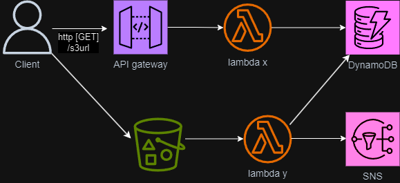

# Handling Large Payloads in an Architecture that Uses API Gateway and Lambda

We used serverless framework for create backend resources

A Rest API will support 10MB of payload

Lambda will support a payload of 6MB for Synchronous invocations

In this architecture we obtain an s3 presigned URL using a lambda function and use it
to securely upload the large payload into an s3 bucket.
A lambda function that subscribed to the objectCreate event will retrieve this payload
and can then process it further and send it to dynamoDB. SNS is used to notify the user
that an object was uploaded.

CORS was manually enabled for the REST API's Get endpoint.

CORS rules were added for the S3 bucket

## What are the resources used in this architecture?

API Gateway

Lambda

S3

DynamoDB

SNS (Created Manually)

The Diagram below shows the architecture.

